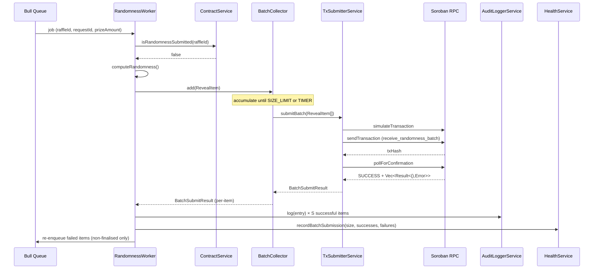

# Design Document — batch-randomness-reveal

## Overview

The batch-randomness-reveal feature reduces on-chain costs by grouping multiple pending reveal jobs into a single Soroban transaction. Instead of one transaction per raffle, the oracle accumulates `RevealItem`s in a `BatchCollector` and flushes them together via a new `receive_randomness_batch` contract entry point. Partial failures within a batch are isolated: failed items are re-queued individually while successful items are audited and discarded.

The design touches four layers:
1. **Configuration** — two new env vars (`BATCH_SIZE`, `BATCH_WINDOW_MS`) with validation and defaults.
2. **Oracle service** — new `BatchCollector` component; updated `RandomnessWorker` and `TxSubmitterService`.
3. **Soroban contract** — new `receive_randomness_batch` entry point returning `Vec<Result<(), Error>>`.
4. **Observability** — new counters on `HealthService`; structured log lines on flush and confirmation.

---

## Architecture



### Single-item fallback path

When `BatchCollector` flushes a batch of exactly one item, `TxSubmitterService` routes to the existing `receive_randomness` entry point rather than `receive_randomness_batch`, preserving backward compatibility and avoiding unnecessary vector encoding overhead.

---

## Components and Interfaces

### BatchCollector

New injectable service in `oracle/src/queue/batch-collector.service.ts`.

```typescript
export interface RevealItem {
  raffleId: number;
  requestId: string;
  seed: string;
  proof: string;
  method: RandomnessMethod;
}

export interface BatchFlushResult {
  items: RevealItem[];
  triggerReason: 'SIZE_LIMIT' | 'TIMER';
}

@Injectable()
export class BatchCollector {
  // Reads BATCH_SIZE (default 5) and BATCH_WINDOW_MS (default 2000) from ConfigService.
  // Exposes:
  add(item: RevealItem): void;
  // Registers a callback invoked on each flush:
  onFlush(handler: (result: BatchFlushResult) => Promise<void>): void;
  // Lifecycle:
  onModuleDestroy(): void; // clears pending timer
}
```

Internal state:
- `buffer: RevealItem[]` — accumulation buffer, cleared on each flush.
- `timerHandle: NodeJS.Timeout | null` — set when the first item enters an empty buffer.
- `inFlight: boolean` — prevents concurrent flushes; new items accumulate while `true`.

### Updated TxSubmitterService

New method alongside the existing `submitRandomness`:

```typescript
export interface BatchSubmitResult {
  txHash: string;
  ledger: number;
  items: Array<{
    raffleId: number;
    success: boolean;
    errorCode?: string; // e.g. 'ALREADY_FINALISED', 'INVALID_PROOF'
  }>;
}

async submitBatch(items: RevealItem[]): Promise<BatchSubmitResult>;
```

- If `items.length === 1`, delegates to `submitRandomness` and wraps the result in `BatchSubmitResult`.
- Otherwise builds a transaction calling `receive_randomness_batch` with a Soroban `Vec` of `(u32, Bytes, Bytes)` tuples.
- Applies the same exponential-backoff retry loop (`MAX_RETRIES`, `INITIAL_BACKOFF_MS`) as `submitRandomness`.
- On total failure, returns a `BatchSubmitResult` with all items marked `success: false`.

### Updated RandomnessWorker

After computing randomness, the worker calls `BatchCollector.add(item)` instead of directly calling `TxSubmitterService`. It registers a flush handler via `BatchCollector.onFlush` that:

1. Calls `TxSubmitterService.submitBatch`.
2. Iterates `BatchSubmitResult.items`:
   - Success → calls `AuditLoggerService.log`.
   - Failure with `errorCode === 'ALREADY_FINALISED'` → discards silently.
   - Other failure → re-enqueues the `raffleId` as a new Bull job.
3. Calls `HealthService.recordBatchSubmission`.

### Updated HealthService

Three new counters added to `HealthMetrics`:

```typescript
batchSubmissions: number;      // total batch tx submitted
totalRevealsBatched: number;   // total individual reveals sent in batches
totalBatchFailures: number;    // batches where tx-level submission failed
```

New method:
```typescript
recordBatchSubmission(batchSize: number, successes: number, failures: number): void;
```

### Soroban Contract — receive_randomness_batch

New entry point in the Rust contract:

```rust
pub fn receive_randomness_batch(
    env: Env,
    entries: Vec<(u32, BytesN<32>, BytesN<64>)>,
) -> Vec<Result<(), Error>>;
```

Processes entries sequentially, applying the same validation as `receive_randomness`. Each entry produces an independent `Result`. The function always returns `Ok` at the Soroban transaction level even when all entries fail, so the transaction is never rolled back.

---

## Data Models

### RevealItem

```typescript
interface RevealItem {
  raffleId: number;
  requestId: string;
  seed: string;       // hex-encoded, 32 bytes
  proof: string;      // hex-encoded, 64 bytes
  method: 'VRF' | 'PRNG';
}
```

### BatchSubmitResult

```typescript
interface BatchSubmitResult {
  txHash: string;
  ledger: number;
  items: Array<{
    raffleId: number;
    success: boolean;
    errorCode?: string;
  }>;
}
```

### AuditLogEntry (extended)

No schema change required. The existing `AuditLogEntry` already carries `tx_hash` and `ledger` fields. Batch reveals share the same `tx_hash` across all successful items in the batch.

### Updated HealthMetrics

```typescript
interface HealthMetrics {
  // ... existing fields ...
  batchSubmissions: number;
  totalRevealsBatched: number;
  totalBatchFailures: number;
}
```

### Environment Configuration

| Variable | Type | Default | Validation |
|---|---|---|---|
| `BATCH_SIZE` | integer | `5` | < 1 → warn, use 5 |
| `BATCH_WINDOW_MS` | integer | `2000` | < 0 → warn, use 2000 |

---

## Correctness Properties

*A property is a characteristic or behavior that should hold true across all valid executions of a system — essentially, a formal statement about what the system should do. Properties serve as the bridge between human-readable specifications and machine-verifiable correctness guarantees.*

### Property 1: Configuration defaults are applied when env vars are absent

*For any* `BatchCollector` instantiated without `BATCH_SIZE` or `BATCH_WINDOW_MS` set in the environment, the effective batch size shall be `5` and the effective window shall be `2000` ms.

**Validates: Requirements 1.1, 1.2**

### Property 2: Invalid configuration falls back to defaults

*For any* integer value less than `1` supplied as `BATCH_SIZE`, or any integer less than `0` supplied as `BATCH_WINDOW_MS`, the `BatchCollector` shall use the default values (`5` and `2000` respectively) rather than the supplied values.

**Validates: Requirements 1.3, 1.4**

### Property 3: Flush delivers all accumulated items and clears the buffer

*For any* sequence of `RevealItem`s added to the `BatchCollector` before a flush, the flush handler shall receive exactly those items, and the internal buffer shall be empty after the flush completes.

**Validates: Requirements 2.1, 2.4**

### Property 4: Size-limit flush triggers at exactly BATCH_SIZE items

*For any* `BATCH_SIZE` N and any N `RevealItem`s added sequentially, the `BatchCollector` shall trigger a flush after the N-th item is added, without waiting for the timer.

**Validates: Requirements 2.2**

### Property 5: Timer flush triggers after BATCH_WINDOW_MS with a non-empty buffer

*For any* non-empty buffer that has not yet reached `BATCH_SIZE`, after `BATCH_WINDOW_MS` elapses since the first item was added, the `BatchCollector` shall flush the accumulated items.

**Validates: Requirements 2.3**

### Property 6: At most one in-flight batch at a time

*For any* sequence of `RevealItem`s added while a flush is in progress, no second flush shall be triggered until the first completes; the new items shall remain in the buffer.

**Validates: Requirements 2.5**

### Property 7: Batch transaction encodes all items

*For any* batch of N `RevealItem`s passed to `TxSubmitterService.submitBatch`, the constructed Soroban transaction shall contain exactly one call to `receive_randomness_batch` with a vector of exactly N `(u32, Bytes, Bytes)` tuples in the same order.

**Validates: Requirements 3.1**

### Property 8: BatchSubmitResult has one entry per input item on success

*For any* batch of N items where the transaction is confirmed with status `SUCCESS`, the returned `BatchSubmitResult.items` array shall have exactly N elements, each carrying the corresponding `raffleId` and a `success` flag.

**Validates: Requirements 3.4**

### Property 9: All items marked failed when transaction exhausts retries

*For any* batch of N items where all `MAX_RETRIES` submission attempts fail, the returned `BatchSubmitResult.items` array shall have exactly N elements all with `success: false`.

**Validates: Requirements 3.5, 3.6**

### Property 10: Contract return value maps to per-item success flags

*For any* `Vec<Result<(), Error>>` returned by the contract, the `BatchSubmitResult` produced by `TxSubmitterService` shall have per-item `success` flags that match the `Ok`/`Err` variants in the same positional order.

**Validates: Requirements 4.1**

### Property 11: Only failed non-finalised items are re-enqueued

*For any* `BatchSubmitResult` with S successful items and F failed items (of which A have `errorCode === 'ALREADY_FINALISED'`), the worker shall enqueue exactly `F - A` new jobs and shall not enqueue any of the S successful items.

**Validates: Requirements 4.2, 4.3**

### Property 12: Already-submitted items are filtered before batching

*For any* `raffleId` for which `ContractService.isRandomnessSubmitted` returns `true`, the `BatchCollector` shall not receive a `RevealItem` for that `raffleId`.

**Validates: Requirements 5.1, 5.2**

### Property 13: Audit log entries match successful items exactly

*For any* batch with S successful items and F failed items, `AuditLoggerService.log` shall be called exactly S times (once per successful item) and shall never be called for any of the F failed items.

**Validates: Requirements 6.1, 6.3**

### Property 14: Each audit log entry contains all required fields

*For any* successful `RevealItem` in a batch, the corresponding `AuditLogEntry` shall contain the shared `tx_hash` and `ledger` from the batch transaction, plus the item-specific `raffle_id`, `request_id`, `seed`, `proof`, and `method`.

**Validates: Requirements 6.2**

### Property 15: receive_randomness_batch is equivalent to receive_randomness for single entries

*For any* valid `(raffle_id, seed, proof)` triple, calling `receive_randomness_batch` with a single-element vector shall produce the same on-chain state change as calling `receive_randomness` with the same arguments.

**Validates: Requirements 7.2**

### Property 16: Partial failure does not abort remaining entries

*For any* batch containing at least one invalid entry and at least one valid entry, the valid entries shall be processed successfully and the invalid entries shall have error results, with the output vector preserving input order.

**Validates: Requirements 7.3, 7.4**

### Property 17: Health counters accurately reflect batch operations

*For any* sequence of batch submissions, the `HealthService` counters `batchSubmissions`, `totalRevealsBatched`, and `totalBatchFailures` shall equal the actual totals of those operations performed.

**Validates: Requirements 8.3**

### Property 18: Single-item batch routes to receive_randomness

*For any* batch containing exactly one `RevealItem`, `TxSubmitterService.submitBatch` shall invoke the `receive_randomness` contract entry point rather than `receive_randomness_batch`.

**Validates: Requirements 8.4**

---

## Error Handling

### Configuration errors
- Invalid `BATCH_SIZE` or `BATCH_WINDOW_MS` values are caught at module init. A `Logger.warn` is emitted and the default is used. The oracle continues to start normally.

### Batch submission failures
- **Transient RPC errors**: Retried with exponential backoff up to `MAX_RETRIES`. Fee bumping applies as in the existing single-item path.
- **Total batch failure**: All items in `BatchSubmitResult` are marked `success: false`. The worker re-enqueues each non-finalised item as an individual Bull job (which will be retried by Bull's own backoff).
- **Partial contract failure**: Items with `errorCode === 'ALREADY_FINALISED'` are silently discarded. All other failed items are re-enqueued.

### In-flight guard
- If the flush handler throws an unhandled exception, `inFlight` is reset to `false` in a `finally` block so the `BatchCollector` does not deadlock.

### Timer cleanup
- `BatchCollector.onModuleDestroy` clears any pending timer to prevent memory leaks during graceful shutdown.

### Audit log failures
- Audit log write failures (disk full, permissions) are caught and logged at `ERROR` level. They do not cause the job to fail or the item to be re-queued, consistent with the existing `AuditLoggerService` behaviour.

---

## Testing Strategy

### Dual approach

Both unit/example tests and property-based tests are required. Unit tests cover specific examples, integration points, and error conditions. Property tests verify universal invariants across randomly generated inputs.

### Property-based testing library

Use **[fast-check](https://github.com/dubzzz/fast-check)** (TypeScript). Each property test runs a minimum of **100 iterations**.

Tag format for each test:
```
// Feature: batch-randomness-reveal, Property N: <property_text>
```

### Property test mapping

| Property | Test description | fast-check arbitraries |
|---|---|---|
| P1 | Default config values | `fc.constant(undefined)` for env vars |
| P2 | Invalid config fallback | `fc.integer({max: 0})` for BATCH_SIZE, `fc.integer({max: -1})` for BATCH_WINDOW_MS |
| P3 | Flush delivers all items, clears buffer | `fc.array(revealItemArb, {minLength: 1})` |
| P4 | Size-limit flush at exactly N items | `fc.integer({min:1,max:20})` for N, array of N items |
| P5 | Timer flush after window | `fc.array(revealItemArb, {minLength:1})` + fake timer |
| P6 | One in-flight at a time | `fc.array(revealItemArb, {minLength:2})` + slow mock flush |
| P7 | Batch tx encodes all items | `fc.array(revealItemArb, {minLength:2})` |
| P8 | BatchSubmitResult length on success | `fc.array(revealItemArb, {minLength:1})` |
| P9 | All failed on retry exhaustion | `fc.array(revealItemArb, {minLength:1})` |
| P10 | Contract return maps to flags | `fc.array(fc.boolean())` for result vector |
| P11 | Re-enqueue only non-finalised failures | `fc.array(batchItemResultArb)` |
| P12 | Already-submitted items filtered | `fc.array(fc.nat())` for raffleIds |
| P13 | Audit log call count | `fc.array(batchItemResultArb, {minLength:1})` |
| P14 | Audit log entry fields | `fc.record({...})` for RevealItem + BatchSubmitResult |
| P15 | Single-entry batch equivalence (contract) | `fc.record({raffleId, seed, proof})` |
| P16 | Partial failure isolation (contract) | `fc.array` with mix of valid/invalid entries |
| P17 | Health counter accuracy | `fc.array(batchOpArb)` |
| P18 | Single-item routes to receive_randomness | `fc.record(revealItemArb)` |

### Unit / example tests

- `BatchCollector` instantiation with valid and invalid config values.
- `TxSubmitterService.submitBatch` with a mocked RPC that returns a known `Vec<Result>`.
- `RandomnessWorker` flush handler: verify audit log calls and re-queue calls for a fixed batch result.
- `HealthService.recordBatchSubmission` increments all three counters correctly.
- Soroban contract: integration test calling `receive_randomness_batch` with a known set of entries on a local test environment.

### Contract tests (Rust)

Use the Soroban test SDK (`soroban_sdk::testutils`):
- Example: call `receive_randomness_batch` with one valid entry — verify `Ok(())` result and on-chain state.
- Property P15: round-trip equivalence with `receive_randomness`.
- Property P16: mixed valid/invalid entries — verify partial success vector.
- Edge case P7.5: all-invalid batch — verify transaction-level `Ok` with all-error result vector.
