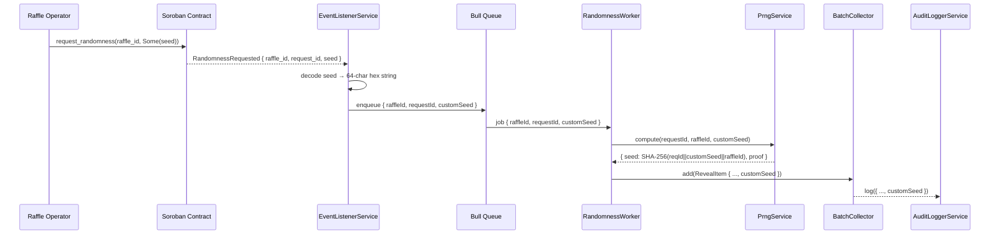

# Design Document — custom-prng-seeds

## Overview

The custom-prng-seeds feature allows raffle operators to supply their own 32-byte entropy ("custom seed") when requesting randomness. The final PRNG seed is derived from both the oracle's internal entropy (`requestId`) and the caller-supplied seed, so neither party alone controls the output.

The change touches four layers:

1. **Soroban contract** — `request_randomness` gains an optional `seed: Option<BytesN<32>>` parameter; the value is forwarded in the `RandomnessRequested` event.
2. **Event listener** — `EventListenerService` decodes the optional `seed` field and forwards it as `customSeed` in `RandomnessJobPayload`.
3. **PRNG derivation** — `PrngService.compute` accepts an optional `customSeed` and mixes it into the SHA-256 hash input when present.
4. **Audit logging** — `AuditLoggerService` persists `customSeed` (or `null`) alongside existing fields.

Backward compatibility is preserved throughout: callers that omit the seed continue to work without any change.

---

## Architecture



### Backward-compatible path (no custom seed)

When `customSeed` is absent the flow is identical to today: `PrngService.compute` receives `undefined` for `customSeed` and falls back to `SHA-256(requestId_bytes [|| raffleId_u32_BE])`.

---

## Components and Interfaces

### Soroban Contract

The `request_randomness` entry point gains one optional parameter:

```rust
pub fn request_randomness(
    env: Env,
    raffle_id: u32,
    seed: Option<BytesN<32>>,   // NEW — caller-supplied entropy
) -> u64 /* request_id */;
```

The `RandomnessRequested` event map gains an optional `seed` key:

```rust
// Event payload (Soroban map)
{
  "raffle_id":  u32,
  "request_id": u64,
  "seed":       Option<BytesN<32>>,  // present only when Some(_)
}
```

When `seed` is `None` the key is omitted entirely, preserving the existing event shape for legacy callers.

### EventListenerService

`handleEvent` is extended to extract the optional `seed` map entry:

```typescript
// Inside the scvMap parsing loop:
} else if (keySym === 'seed') {
  customSeed = this.parseSeedField(entry.val()); // returns hex string | undefined
}
```

New helper:

```typescript
private parseSeedField(val: StellarSdk.xdr.ScVal): string | undefined {
  // Expects scvBytes of length 32; returns 64-char lowercase hex or undefined on error.
}
```

On decode failure the helper logs at `WARN` level and returns `undefined`.

### RandomnessJobPayload (updated)

```typescript
export interface RandomnessJobPayload {
  raffleId: number;
  requestId: string;
  prizeAmount?: number;
  customSeed?: string;   // NEW — 64-char hex string, undefined when absent
}
```

### PrngService (updated)

`compute` gains an optional third parameter:

```typescript
compute(requestId: string, raffleId?: number, customSeed?: string): RandomnessResult
```

Derivation logic:

```typescript
// Validate customSeed if provided
if (customSeed !== undefined) {
  if (!/^[0-9a-fA-F]{64}$/.test(customSeed)) {
    throw new Error(`customSeed must be a 64-character hex string, got length ${customSeed.length}`);
  }
}

// Seed = SHA-256( requestId_bytes || [customSeed_bytes ||] [raffleId_u32_BE] )
const seedHasher = crypto.createHash('sha256').update(reqBuf);
if (customSeed !== undefined) {
  seedHasher.update(Buffer.from(customSeed, 'hex'));
}
if (raffleId !== undefined) {
  seedHasher.update(this.encodeUint32BE(raffleId));
}
const seedBuf = seedHasher.digest();

// Proof derivation is UNCHANGED — does not include customSeed
```

The proof remains `SHA-256("PRNG:v1:1:" || requestId_bytes) || SHA-256("PRNG:v1:2:" || requestId_bytes)`.

### RandomnessWorker (updated)

`handleRandomnessJob` reads `customSeed` from the payload and threads it through:

```typescript
const { raffleId, requestId, prizeAmount, customSeed } = job.data;

// In computeRandomness (PRNG path only):
return this.prngService.compute(requestId, raffleId, customSeed);

// RevealItem now carries customSeed:
const revealItem: RevealItem = {
  raffleId, requestId, seed: randomness.seed, proof: randomness.proof,
  method, customSeed,
};
```

VRF path: `customSeed` is read from the payload but not forwarded to `VrfService`.

### RevealItem (updated)

```typescript
export interface RevealItem {
  raffleId: number;
  requestId: string;
  seed: string;
  proof: string;
  method: RandomnessMethod;
  customSeed?: string;   // NEW
}
```

### AuditLogEntry (updated)

```typescript
export interface AuditLogEntry {
  timestamp: string;
  raffle_id: number;
  request_id: string;
  oracle_id: string;
  seed: string;
  proof: string;
  tx_hash: string;
  method: 'VRF' | 'PRNG';
  custom_seed: string | null;   // NEW — null when no custom seed was used
}
```

`AuditLoggerService.log` is updated to accept and persist `customSeed`:

```typescript
async log(entry: Omit<AuditLogEntry, 'timestamp' | 'oracle_id'>): Promise<void>
// caller passes custom_seed: revealItem.customSeed ?? null
```

---

## Data Models

### RandomnessJobPayload

| Field | Type | Notes |
|---|---|---|
| `raffleId` | `number` | Unchanged |
| `requestId` | `string` | Unchanged |
| `prizeAmount` | `number \| undefined` | Unchanged |
| `customSeed` | `string \| undefined` | NEW — 64-char hex or absent |

### RevealItem

| Field | Type | Notes |
|---|---|---|
| `raffleId` | `number` | Unchanged |
| `requestId` | `string` | Unchanged |
| `seed` | `string` | Unchanged |
| `proof` | `string` | Unchanged |
| `method` | `RandomnessMethod` | Unchanged |
| `customSeed` | `string \| undefined` | NEW |

### AuditLogEntry

| Field | Type | Notes |
|---|---|---|
| `timestamp` | `string` | Unchanged |
| `raffle_id` | `number` | Unchanged |
| `request_id` | `string` | Unchanged |
| `oracle_id` | `string` | Unchanged |
| `seed` | `string` | Unchanged |
| `proof` | `string` | Unchanged |
| `tx_hash` | `string` | Unchanged |
| `method` | `'VRF' \| 'PRNG'` | Unchanged |
| `custom_seed` | `string \| null` | NEW |

### Entropy mixing formula

```
seed  = SHA-256( requestId_bytes
               || customSeed_bytes   ← only when customSeed present
               [|| raffleId_u32_BE]  ← only when raffleId present
               )

proof = SHA-256("PRNG:v1:1:" || requestId_bytes)
     || SHA-256("PRNG:v1:2:" || requestId_bytes)
       ← proof is NEVER affected by customSeed
```

---

## Correctness Properties

*A property is a characteristic or behavior that should hold true across all valid executions of a system — essentially, a formal statement about what the system should do. Properties serve as the bridge between human-readable specifications and machine-verifiable correctness guarantees.*

### Property 1: Event seed round-trip

*For any* valid 32-byte seed passed to `request_randomness`, the `RandomnessRequested` event emitted by the contract shall contain a `seed` field whose decoded bytes are equal to the original input, and the `EventListenerService` shall produce a `customSeed` hex string that round-trips back to those same bytes.

**Validates: Requirements 1.2, 2.1**

### Property 2: PRNG seed derivation formula

*For any* valid `requestId` string and valid 64-character hex `customSeed`, the `seed` returned by `PrngService.compute` shall equal the lowercase hex encoding of `SHA-256(requestId_bytes || customSeed_bytes [|| raffleId_u32_BE])`.

**Validates: Requirements 3.1, 3.4**

### Property 3: Backward compatibility — no custom seed preserves existing output and proof

*For any* valid `requestId` (and optional `raffleId`), calling `PrngService.compute` without `customSeed` shall produce the same `seed` and `proof` as the pre-feature implementation, and calling it with `customSeed` shall produce the same `proof` as calling it without `customSeed` for the same `requestId`.

**Validates: Requirements 3.2, 3.3**

### Property 4: Invalid custom seed is rejected

*For any* string that is not a valid 64-character hexadecimal string (wrong length, non-hex characters, or empty), `PrngService.compute` shall throw an `Error` and shall not return a seed or proof.

**Validates: Requirements 3.5**

### Property 5: Determinism of PRNG computation

*For any* valid `requestId`, optional `raffleId`, and optional `customSeed`, calling `PrngService.compute` twice with identical inputs shall return identical `seed` and `proof` values.

**Validates: Requirements 3.6**

### Property 6: Custom seed propagation through the worker

*For any* `RandomnessJobPayload` with method `PRNG` and an optional `customSeed`, the `RevealItem` added to `BatchCollector` shall carry the same `customSeed` value, and `PrngService.compute` shall have been called with that same `customSeed`.

**Validates: Requirements 4.1, 4.3**

### Property 7: Audit log persists custom seed

*For any* successfully submitted `RevealItem`, the corresponding `AuditLogEntry` written by `AuditLoggerService` shall contain a `custom_seed` field equal to the `customSeed` from the `RevealItem` when present, or `null` when absent.

**Validates: Requirements 5.1, 5.2**

---

## Error Handling

### Invalid seed in event payload (EventListenerService)
- If the `seed` XDR value cannot be decoded as 32 bytes, `parseSeedField` logs at `WARN` level, returns `undefined`, and processing continues with `customSeed: undefined`. The job is not dropped.

### Invalid customSeed in PrngService
- If `customSeed` is provided but fails the `/^[0-9a-fA-F]{64}$/` regex, `compute` throws an `Error` with a descriptive message. The `RandomnessWorker` catches this, logs at `ERROR`, records a failure via `HealthService`, and re-throws to trigger Bull's retry mechanism.

### VRF path — customSeed silently ignored
- When `method === VRF`, `customSeed` is present in the payload but is never forwarded to `VrfService`. No error is raised; the field is still stored in `RevealItem` for audit purposes.

### Audit log failures
- Consistent with existing behaviour: write failures are caught and logged at `ERROR` level but do not cause the job to fail or be re-queued.

---

## Testing Strategy

### Dual approach

Both unit/example tests and property-based tests are required. Unit tests cover specific examples, integration points, and error conditions. Property tests verify universal invariants across randomly generated inputs.

### Property-based testing library

Use **[fast-check](https://github.com/dubzzz/fast-check)** (TypeScript). Each property test runs a minimum of **100 iterations**.

Tag format for each test:
```
// Feature: custom-prng-seeds, Property N: <property_text>
```

### Property test mapping

| Property | Test description | fast-check arbitraries |
|---|---|---|
| P1 | Event seed round-trip | `fc.uint8Array({minLength:32,maxLength:32})` for seed bytes |
| P2 | PRNG seed derivation formula | `fc.string()` for requestId, `fc.hexaString({minLength:64,maxLength:64})` for customSeed, `fc.option(fc.nat({max:0xFFFFFFFF}))` for raffleId |
| P3 | Backward compat: no customSeed preserves output; proof unchanged by customSeed | `fc.string()` for requestId, `fc.hexaString({minLength:64,maxLength:64})` for customSeed |
| P4 | Invalid customSeed throws | `fc.oneof(fc.string().filter(s => !/^[0-9a-fA-F]{64}$/.test(s)), fc.hexaString({minLength:65}), fc.hexaString({maxLength:63}))` |
| P5 | Determinism | `fc.string()` for requestId, `fc.option(fc.hexaString({minLength:64,maxLength:64}))` for customSeed |
| P6 | Worker propagates customSeed to PRNG and RevealItem | `fc.record({raffleId: fc.nat(), requestId: fc.string(), customSeed: fc.option(fc.hexaString({minLength:64,maxLength:64}))})` |
| P7 | Audit log persists customSeed | `fc.record({...revealItemFields, customSeed: fc.option(fc.hexaString({minLength:64,maxLength:64}))})` |

### Unit / example tests

- `EventListenerService`: event with seed field → `customSeed` set correctly; event without seed → `customSeed` undefined; event with malformed seed → `WARN` logged, `customSeed` undefined.
- `PrngService`: calling without `customSeed` produces same result as current implementation (regression guard); calling with `customSeed` produces expected SHA-256 output for a known input.
- `RandomnessWorker`: VRF path — `VrfService.compute` called without `customSeed`; PRNG path — `PrngService.compute` called with `customSeed` from payload.
- `AuditLoggerService`: entry with `custom_seed: null` serialises correctly; entry with a hex `custom_seed` round-trips through `readEntries`.

### Contract tests (Rust, Soroban test SDK)

- Example: `request_randomness(raffle_id, Some(seed))` emits event with matching `seed` field.
- Example: `request_randomness(raffle_id, None)` emits event without `seed` field.
- Property P1: for any 32-byte seed, the emitted event seed bytes equal the input.
