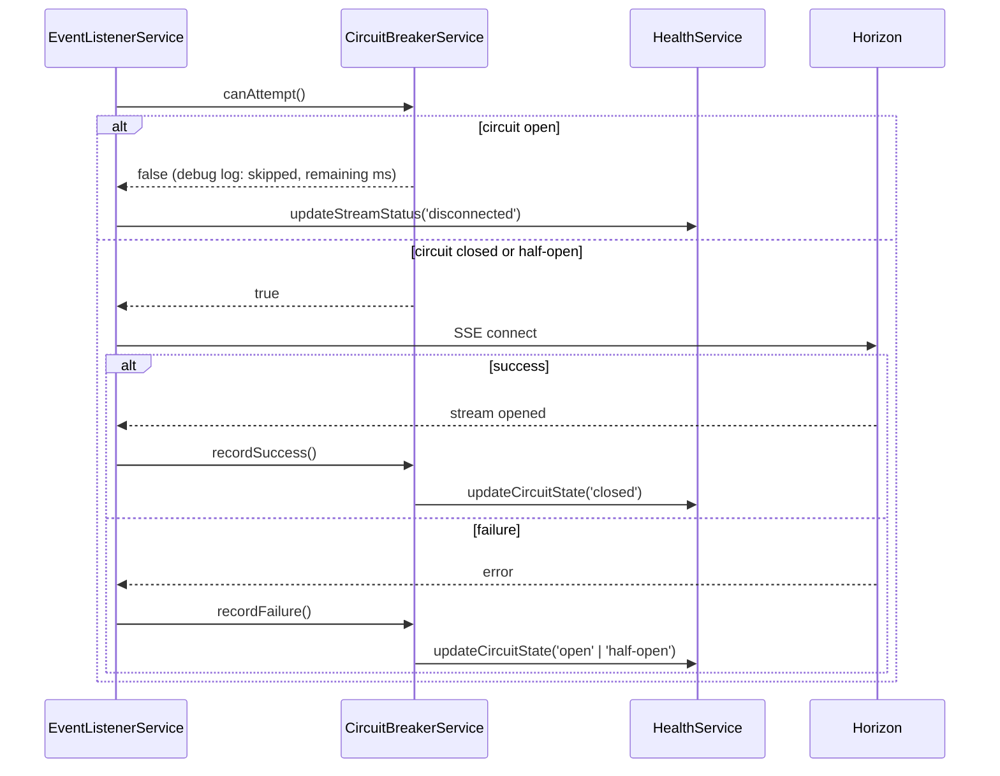
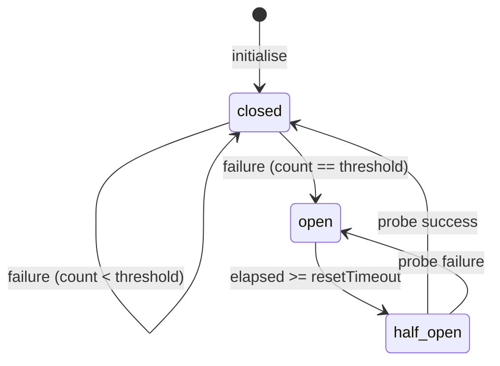

# Design Document: Horizon Circuit Breaker

## Overview

The Horizon Circuit Breaker adds a fault-tolerance layer to the oracle's `EventListenerService`. It wraps every Horizon SSE connection attempt in a three-state machine (`closed → open → half-open → closed`) that halts retries after a configurable number of consecutive failures and resumes them only after a configurable cooldown period.

The implementation introduces a single new class, `CircuitBreakerService`, that is injected into `EventListenerService`. The existing reconnect loop is gated by the circuit breaker before each attempt. `HealthService` is extended with a `circuitState` field so operators can observe the circuit state via `GET /health`.

### Key Design Decisions

- **Separate service, not inline logic** — `CircuitBreakerService` is a standalone NestJS `@Injectable()` so it can be unit-tested in isolation and injected wherever needed.
- **Callback-based API** — `EventListenerService` calls `recordSuccess()` / `recordFailure()` on the circuit breaker after each attempt outcome, keeping the circuit breaker decoupled from the SSE internals.
- **Synchronous state transitions** — all state changes happen synchronously inside `recordSuccess()` / `recordFailure()` / `canAttempt()`, avoiding race conditions in the single-threaded Node.js event loop.
- **`fast-check` for property tests** — already present in `devDependencies`; no new dependencies required.

---

## Architecture



### State Machine



---

## Components and Interfaces

### `CircuitBreakerService`

New file: `oracle/src/listener/circuit-breaker.service.ts`

```typescript
export type CircuitState = 'closed' | 'open' | 'half-open';

export interface CircuitBreakerConfig {
  failureThreshold: number;   // ORACLE_CB_FAILURE_THRESHOLD
  resetTimeoutMs: number;     // ORACLE_CB_RESET_TIMEOUT_MS
}

@Injectable()
export class CircuitBreakerService {
  /** Returns true if a connection attempt is permitted. */
  canAttempt(): boolean;

  /** Call after a successful SSE connection. */
  recordSuccess(): void;

  /** Call after a failed SSE connection attempt. */
  recordFailure(): void;

  /** Current circuit state (for health reporting). */
  getState(): CircuitState;
}
```

### `HealthService` (extended)

`HealthMetrics` gains a new field:

```typescript
circuitState: CircuitState;  // 'closed' | 'open' | 'half-open'
```

New method on `HealthService`:

```typescript
updateCircuitState(state: CircuitState): void;
```

`getMetrics()` returns `circuitState` from internal state, defaulting to `'closed'` if never set.

### `EventListenerService` (modified)

- Injects `CircuitBreakerService`.
- Calls `circuitBreaker.canAttempt()` at the top of `startListening()`.
- Calls `circuitBreaker.recordSuccess()` when the SSE stream opens successfully.
- Calls `circuitBreaker.recordFailure()` inside `handleStreamError()` and the `catch` block of `startListening()`.
- When `canAttempt()` returns `false`, calls `healthService.updateStreamStatus('disconnected')` and schedules a retry after the remaining cooldown (obtained from a new `getRemainingCooldownMs()` helper on `CircuitBreakerService`).

### `ListenerModule` (modified)

Adds `CircuitBreakerService` to `providers` and `exports`.

---

## Data Models

### `CircuitBreakerService` internal state

| Field | Type | Description |
|---|---|---|
| `state` | `CircuitState` | Current circuit state |
| `consecutiveFailures` | `number` | Failures since last success |
| `openedAt` | `number \| null` | `Date.now()` timestamp when circuit opened |
| `config` | `CircuitBreakerConfig` | Resolved threshold and timeout |

### `HealthMetrics` (extended)

```typescript
export interface HealthMetrics {
  // ... existing fields ...
  circuitState: CircuitState;
}
```

### Environment variables

| Variable | Type | Default | Validation |
|---|---|---|---|
| `ORACLE_CB_FAILURE_THRESHOLD` | positive integer | `5` | warn + fallback if invalid |
| `ORACLE_CB_RESET_TIMEOUT_MS` | positive integer | `60000` | warn + fallback if invalid |

---

## Correctness Properties

*A property is a characteristic or behavior that should hold true across all valid executions of a system — essentially, a formal statement about what the system should do. Properties serve as the bridge between human-readable specifications and machine-verifiable correctness guarantees.*

### Property 1: Closed circuit permits attempts and resets on success

*For any* `CircuitBreakerService` in the `closed` state, calling `recordSuccess()` SHALL leave the state as `closed` and reset `consecutiveFailures` to zero.

**Validates: Requirements 1.3**

---

### Property 2: Failure accumulation opens the circuit at threshold

*For any* `CircuitBreakerService` in the `closed` state with a failure threshold N, calling `recordFailure()` exactly N times SHALL transition the state to `open` and `canAttempt()` SHALL return `false` immediately after.

**Validates: Requirements 1.4, 1.5, 1.6**

---

### Property 3: Open circuit blocks all attempts until timeout elapses

*For any* `CircuitBreakerService` in the `open` state where the elapsed time since opening is less than `resetTimeoutMs`, `canAttempt()` SHALL return `false`.

**Validates: Requirements 1.6**

---

### Property 4: Half-open allows exactly one probe then re-evaluates

*For any* `CircuitBreakerService` that has transitioned to `half-open`, calling `canAttempt()` once SHALL return `true`; a subsequent call (before recording an outcome) SHALL return `false`.

**Validates: Requirements 1.7, 1.8**

---

### Property 5: Successful probe closes the circuit

*For any* `CircuitBreakerService` in the `half-open` state, calling `recordSuccess()` SHALL transition the state to `closed` and reset `consecutiveFailures` to zero.

**Validates: Requirements 1.9**

---

### Property 6: Failed probe re-opens the circuit with a fresh timestamp

*For any* `CircuitBreakerService` in the `half-open` state, calling `recordFailure()` SHALL transition the state back to `open` and record a new `openedAt` timestamp.

**Validates: Requirements 1.10**

---

### Property 7: Invalid env-var values fall back to defaults

*For any* string value of `ORACLE_CB_FAILURE_THRESHOLD` or `ORACLE_CB_RESET_TIMEOUT_MS` that is not a positive integer (e.g. `"0"`, `"-1"`, `"abc"`, `""`), the resolved config SHALL equal the default values (5 and 60 000 ms respectively).

**Validates: Requirements 2.5, 2.6**

---

### Property 8: Health service always reflects the latest circuit state

*For any* sequence of `recordSuccess()` / `recordFailure()` calls on `CircuitBreakerService`, the `circuitState` returned by `HealthService.getMetrics()` SHALL equal `CircuitBreakerService.getState()` after each call.

**Validates: Requirements 3.1, 3.2, 3.3**

---

## Error Handling

| Scenario | Handling |
|---|---|
| `ORACLE_CB_FAILURE_THRESHOLD` not a positive integer | Log `warn`, use default `5` |
| `ORACLE_CB_RESET_TIMEOUT_MS` not a positive integer | Log `warn`, use default `60000` |
| SSE stream throws synchronously in `startListening()` | Caught by existing `try/catch`; `recordFailure()` called |
| SSE stream emits error via `onerror` callback | Existing `handleStreamError()` calls `recordFailure()` |
| Circuit open when reconnect timer fires | `canAttempt()` returns `false`; timer rescheduled for remaining cooldown |
| `HealthService` not yet notified of circuit state | `getMetrics()` returns `circuitState: 'closed'` as default |

---

## Testing Strategy

### Unit Tests (Jest + `@nestjs/testing`)

- `CircuitBreakerService` state machine transitions (all edges of the state diagram)
- Config parsing: valid values, missing values, invalid values (non-integer, zero, negative)
- `HealthService.updateCircuitState()` and `getMetrics()` returning correct `circuitState`
- `EventListenerService` consulting `canAttempt()` before each attempt (mock `CircuitBreakerService`)
- `EventListenerService` calling `recordSuccess()` / `recordFailure()` at the right points

### Property-Based Tests (fast-check — already in `devDependencies`)

`fast-check` is used for all correctness properties listed above. Each test runs a minimum of 100 iterations.

Tag format per test: `// Feature: horizon-circuit-breaker, Property N: <property text>`

| Property | Generator strategy |
|---|---|
| P1 — success resets | Arbitrary initial `consecutiveFailures` in `[0, threshold-1]` |
| P2 — threshold opens | Arbitrary threshold in `[1, 20]`; drive exactly N failures |
| P3 — open blocks | Arbitrary `resetTimeoutMs`; mock `Date.now()` to stay within window |
| P4 — half-open single probe | Arbitrary config; advance time past timeout |
| P5 — probe success closes | Arbitrary config; reach half-open, then succeed |
| P6 — probe failure re-opens | Arbitrary config; reach half-open, then fail |
| P7 — invalid env fallback | Arbitrary non-positive-integer strings |
| P8 — health mirrors state | Arbitrary sequence of success/failure calls |

### Integration Tests

- `GET /health` response includes `circuitState` field with a valid value (`closed`, `open`, or `half-open`)
- `GET /oracle/status` continues to return all existing fields after the change

### What is NOT property-tested

- Log message content (verified by unit test with spy)
- SSE stream internals (Horizon SDK behaviour — verified by existing integration tests)
