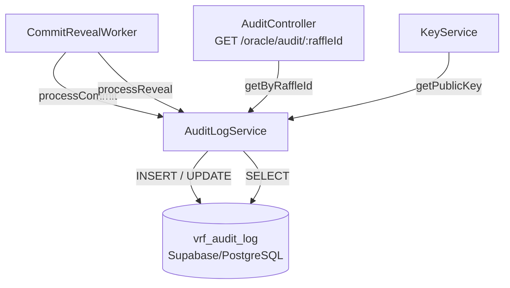

# Design Document: VRF Audit Trail

## Overview

The VRF Audit Trail feature adds a persistent, tamper-detectable audit log to the oracle's commit-reveal randomness scheme. Currently, `CommitRevealWorker` discards all intermediate state after a successful reveal, making post-hoc verification impossible. This design introduces:

- A `vrf_audit_log` PostgreSQL table (via Supabase) that captures both phases of every draw
- A SHA-256 chain hash linking consecutive records so tampering is detectable
- A public `GET /oracle/audit/:raffleId` HTTP endpoint for independent verification

The feature is implemented entirely within the `oracle` NestJS application, following the existing module and service patterns already established there.

## Architecture



The `AuditLogModule` is a self-contained NestJS module that exports `AuditLogService`. `QueueModule` imports `AuditLogModule` so that `CommitRevealWorker` can inject `AuditLogService`. `AuditLogModule` also registers `AuditController` directly.

### Integration Points

| Existing component | Change |
|---|---|
| `CommitRevealWorker.processCommit` | Calls `auditLogService.createCommitRecord(...)` after successful `txSubmitter.submitCommitment` |
| `CommitRevealWorker.processReveal` | Calls `auditLogService.updateRevealRecord(...)` after successful `txSubmitter.submitReveal` |
| `AppModule` | Imports `AuditLogModule` |
| `QueueModule` | Imports `AuditLogModule` |

Errors from `AuditLogService` are caught and logged by the worker; they never propagate to fail the underlying commit or reveal transaction (fire-and-forget audit writes).

## Components and Interfaces

### AuditLogModule (`oracle/src/audit/audit.module.ts`)

```typescript
@Module({
  imports: [KeysModule],
  providers: [AuditLogService, SupabaseProvider],
  controllers: [AuditController],
  exports: [AuditLogService],
})
export class AuditLogModule {}
```

`SupabaseProvider` follows the same pattern as `backend/src/services/supabase.provider.ts`, reading `SUPABASE_URL` and `SUPABASE_SERVICE_ROLE_KEY` from the environment via `ConfigService`.

### AuditLogService (`oracle/src/audit/audit-log.service.ts`)

```typescript
interface CreateCommitParams {
  raffleId: number;
  commitmentHash: string;
  oraclePublicKey: string;
  committedAt: Date;
}

interface UpdateRevealParams {
  raffleId: number;
  requestId: string;
  secret: string;
  nonce: string;
  seed: string;
  proof: string;
  revealedAt: Date;
  ledgerSequence: number;
}

interface VrfAuditRecord {
  id: number;
  raffle_id: number;
  request_id: string | null;
  commitment_hash: string;
  reveal_hash: string | null;
  proof: string | null;
  seed: string | null;
  oracle_public_key: string;
  status: 'committed' | 'revealed' | 'abandoned';
  committed_at: string;
  revealed_at: string | null;
  ledger_sequence: number | null;
  chain_hash: string;
}

class AuditLogService {
  createCommitRecord(params: CreateCommitParams): Promise<void>
  updateRevealRecord(params: UpdateRevealParams): Promise<void>
  markAbandoned(raffleId: number): Promise<void>
  getByRaffleId(raffleId: number): Promise<VrfAuditRecord | null>
  verifyChain(fromId?: number): Promise<boolean>
}
```

Key internal helpers:

- `computeChainHash(record: Partial<VrfAuditRecord>, previousChainHash: string): string` — pure function, SHA-256 over the canonical field concatenation
- `computeRevealHash(secret: string, nonce: string, seed: string, proof: string): string` — SHA-256 over `secret || nonce || seed || proof`
- `getPreviousChainHash(beforeId?: number): Promise<string>` — fetches the `chain_hash` of the record with the largest `id` less than `beforeId`, or returns `"GENESIS"`

### AuditController (`oracle/src/audit/audit.controller.ts`)

```typescript
@Controller('oracle')
class AuditController {
  @Get('audit/:raffleId')
  getAuditRecord(@Param('raffleId') raffleId: string): Promise<VrfAuditRecord>
}
```

- Validates `raffleId` is a positive integer; returns HTTP 400 otherwise
- Returns HTTP 404 with `{ "error": "Audit record not found" }` when no record exists
- Never exposes `secret` or `nonce` (these are never stored; only hashes are persisted)

### CommitRevealWorker changes

```typescript
// processCommit — after successful submitCommitment:
try {
  await this.auditLogService.createCommitRecord({
    raffleId,
    commitmentHash: commitment,
    oraclePublicKey: await this.keyService.getPublicKey(),
    committedAt: new Date(),
  });
} catch (auditError) {
  this.logger.error(`Audit log write failed for commit ${raffleId}: ${auditError.message}`);
}

// processReveal — after successful submitReveal:
try {
  await this.auditLogService.updateRevealRecord({
    raffleId,
    requestId,
    secret: reveal.secret,
    nonce: reveal.nonce,
    seed: result.seed,
    proof: result.proof,
    revealedAt: new Date(),
    ledgerSequence: result.ledger,
  });
} catch (auditError) {
  this.logger.error(`Audit log write failed for reveal ${raffleId}: ${auditError.message}`);
}
```

`KeyService` is injected into `CommitRevealWorker` (it is already available via `KeysModule`).

## Data Models

### `vrf_audit_log` table

```sql
CREATE TABLE vrf_audit_log (
  id               BIGSERIAL PRIMARY KEY,
  raffle_id        INTEGER     NOT NULL UNIQUE,
  request_id       TEXT,
  commitment_hash  TEXT        NOT NULL,
  reveal_hash      TEXT,
  proof            TEXT,
  seed             TEXT,
  oracle_public_key TEXT       NOT NULL,
  status           TEXT        NOT NULL CHECK (status IN ('committed', 'revealed', 'abandoned')),
  committed_at     TIMESTAMPTZ NOT NULL,
  revealed_at      TIMESTAMPTZ,
  ledger_sequence  INTEGER,
  chain_hash       TEXT        NOT NULL
);

CREATE INDEX idx_vrf_audit_log_raffle_id    ON vrf_audit_log (raffle_id);
CREATE INDEX idx_vrf_audit_log_committed_at ON vrf_audit_log (committed_at DESC);

ALTER TABLE vrf_audit_log ENABLE ROW LEVEL SECURITY;
CREATE POLICY "public_select" ON vrf_audit_log FOR SELECT USING (true);
```

### Chain Hash Computation

The chain hash is a SHA-256 digest over the following fields concatenated in order (empty string used for any null field):

```
SHA-256(
  raffle_id          (decimal string)
  || commitment_hash
  || reveal_hash     (or "")
  || proof           (or "")
  || seed            (or "")
  || oracle_public_key
  || status
  || committed_at    (ISO 8601 UTC)
  || previous_chain_hash  (or "GENESIS")
)
```

The chain hash is computed twice per record:
1. At **commit time** — with `reveal_hash`, `proof`, `seed` as empty strings and `status = 'committed'`
2. At **reveal time** — recomputed with all fields populated and `status = 'revealed'`

This means the stored `chain_hash` always reflects the final state of the record.

### Reveal Hash Computation

```
reveal_hash = SHA-256(secret || nonce || seed || proof)
```

Raw `secret` and `nonce` are never stored; only `reveal_hash` is persisted.

### TypeScript type

```typescript
export type AuditStatus = 'committed' | 'revealed' | 'abandoned';

export interface VrfAuditRecord {
  id: number;
  raffle_id: number;
  request_id: string | null;
  commitment_hash: string;
  reveal_hash: string | null;
  proof: string | null;
  seed: string | null;
  oracle_public_key: string;
  status: AuditStatus;
  committed_at: string;       // ISO 8601
  revealed_at: string | null; // ISO 8601
  ledger_sequence: number | null;
  chain_hash: string;
}
```


## Correctness Properties

*A property is a characteristic or behavior that should hold true across all valid executions of a system — essentially, a formal statement about what the system should do. Properties serve as the bridge between human-readable specifications and machine-verifiable correctness guarantees.*

### Property 1: Audit record round-trip

*For any* valid `(raffleId, commitmentHash, oraclePublicKey)` tuple passed to `createCommitRecord`, and any subsequent `(requestId, seed, proof, ledgerSequence)` tuple passed to `updateRevealRecord` for the same `raffleId`, reading back the stored record SHALL return exactly those field values with `status = 'revealed'` and a non-null `reveal_hash`.

**Validates: Requirements 1.1, 2.1**

---

### Property 2: Reveal hash computation

*For any* `(secret, nonce, seed, proof)` tuple, `computeRevealHash(secret, nonce, seed, proof)` SHALL return the same value as independently computing `SHA-256(secret || nonce || seed || proof)`, and calling it twice with the same inputs SHALL return the same result (determinism).

**Validates: Requirements 2.2**

---

### Property 3: Chain hash computation

*For any* set of record fields `(raffleId, commitmentHash, revealHash, proof, seed, oraclePublicKey, status, committedAt)` and any `previousChainHash` string, `computeChainHash(fields, previousChainHash)` SHALL return the same value as independently computing `SHA-256` over the canonical concatenation of those fields in the specified order, and calling it twice with the same inputs SHALL return the same result.

**Validates: Requirements 1.4, 5.1**

---

### Property 4: Chain integrity across sequences

*For any* sequence of audit records generated by `createCommitRecord` and `updateRevealRecord` calls, every consecutive pair `(R_n, R_{n+1})` SHALL satisfy: recomputing `R_{n+1}.chain_hash` from `R_{n+1}`'s stored fields and `R_n.chain_hash` produces the same value as the stored `R_{n+1}.chain_hash`.

**Validates: Requirements 5.3**

---

### Property 5: verifyChain detects tampering

*For any* valid chain of audit records, `verifyChain()` SHALL return `true`. *For any* chain where at least one record's stored `chain_hash` has been mutated to a different value, `verifyChain()` SHALL return `false`.

**Validates: Requirements 5.4**

---

### Property 6: Abandoned record marking

*For any* `raffleId` with an existing `status = 'committed'` record, calling `markAbandoned(raffleId)` SHALL result in the stored record having `status = 'abandoned'` and a non-null `revealed_at` timestamp.

**Validates: Requirements 3.1**

---

### Property 7: Abandonment eligibility

*For any* set of audit records with varying `committed_at` timestamps and a configured draw timeout `T`, the set of records returned as eligible for abandonment SHALL be exactly those records where `status = 'committed'` AND `committed_at < now() - T`.

**Validates: Requirements 3.3**

---

### Property 8: Audit endpoint response completeness

*For any* stored `VrfAuditRecord`, the JSON response from `GET /oracle/audit/:raffleId` SHALL contain all of the following fields: `id`, `raffle_id`, `request_id`, `commitment_hash`, `reveal_hash`, `proof`, `seed`, `oracle_public_key`, `status`, `committed_at`, `revealed_at`, `ledger_sequence`, `chain_hash` — and SHALL NOT contain fields named `secret` or `nonce`.

**Validates: Requirements 4.2, 4.5**

---

### Property 9: Invalid raffleId rejected with 400

*For any* `raffleId` value that is not a positive integer (including strings, zero, negative numbers, and non-integer floats), `GET /oracle/audit/:raffleId` SHALL return HTTP 400 with body `{ "error": "Invalid raffleId" }`.

**Validates: Requirements 4.4**

---

## Error Handling

### Audit write failures are non-fatal

Both `processCommit` and `processReveal` wrap audit log calls in `try/catch`. If `AuditLogService` throws for any reason (DB unavailable, network error, constraint violation), the worker logs the error at `ERROR` level and continues. The underlying commit or reveal transaction is unaffected.

This is a deliberate trade-off: the audit trail is a secondary concern; the primary concern is that draws complete successfully.

### Missing commit record during reveal

If `updateRevealRecord` is called for a `raffleId` with no prior commit record (e.g., the commit audit write failed), the service logs a `WARN` and inserts a new record with the available reveal data and `status = 'revealed'`. This ensures the audit trail is as complete as possible even under partial failures.

### Supabase client errors

All Supabase calls check the returned `error` field. If an error is present, the service throws a descriptive `Error` so the caller's `try/catch` can handle it uniformly.

### HTTP error responses

| Condition | Status | Body |
|---|---|---|
| `raffleId` not a positive integer | 400 | `{ "error": "Invalid raffleId" }` |
| No record found for `raffleId` | 404 | `{ "error": "Audit record not found" }` |
| Unexpected service error | 500 | `{ "error": "Internal server error" }` |

## Testing Strategy

### Unit tests (example-based)

Focus on specific scenarios and integration points:

- `CommitRevealWorker`: audit write failure does not propagate (Requirements 1.3, 2.5)
- `CommitRevealWorker`: audit write failure is logged (Requirements 1.3, 2.5)
- `AuditLogService.updateRevealRecord`: missing commit record triggers warn + insert (Requirement 2.4)
- `AuditController`: unauthenticated GET succeeds (Requirement 4.1)
- `AuditController`: non-existent raffleId returns 404 (Requirement 4.3)
- `AuditLogService.getPreviousChainHash`: returns `"GENESIS"` when no prior records exist
- `AuditLogService.getPreviousChainHash`: returns correct predecessor's chain_hash

### Property-based tests

Using **[fast-check](https://github.com/dubzzz/fast-check)** (already available in the TypeScript ecosystem; add as a dev dependency to the oracle package).

Each property test runs a minimum of **100 iterations**.

| Property | Tag |
|---|---|
| Property 1: Audit record round-trip | `Feature: vrf-audit-trail, Property 1: audit record round-trip` |
| Property 2: Reveal hash computation | `Feature: vrf-audit-trail, Property 2: reveal hash computation` |
| Property 3: Chain hash computation | `Feature: vrf-audit-trail, Property 3: chain hash computation` |
| Property 4: Chain integrity across sequences | `Feature: vrf-audit-trail, Property 4: chain integrity across sequences` |
| Property 5: verifyChain detects tampering | `Feature: vrf-audit-trail, Property 5: verifyChain detects tampering` |
| Property 6: Abandoned record marking | `Feature: vrf-audit-trail, Property 6: abandoned record marking` |
| Property 7: Abandonment eligibility | `Feature: vrf-audit-trail, Property 7: abandonment eligibility` |
| Property 8: Audit endpoint response completeness | `Feature: vrf-audit-trail, Property 8: audit endpoint response completeness` |
| Property 9: Invalid raffleId rejected with 400 | `Feature: vrf-audit-trail, Property 9: invalid raffleId rejected with 400` |

Properties 1–7 test `AuditLogService` in isolation using an in-memory mock of the Supabase client (no real DB calls). Properties 8–9 test `AuditController` using NestJS `Test.createTestingModule` with a mocked `AuditLogService`.

### Integration / smoke tests

- Migration smoke test: verify `vrf_audit_log` table exists with all required columns, indexes, RLS enabled, and public SELECT policy (Requirements 6.1, 6.2, 6.3)
- Unique constraint test: verify inserting two records with the same `raffle_id` fails (Requirement 1.2)
- Status constraint test: verify inserting a record with an invalid `status` value fails (Requirement 3.2)

These run against a real Supabase test instance (or a local PostgreSQL container) and are tagged as integration tests, separate from the unit/property test suite.
